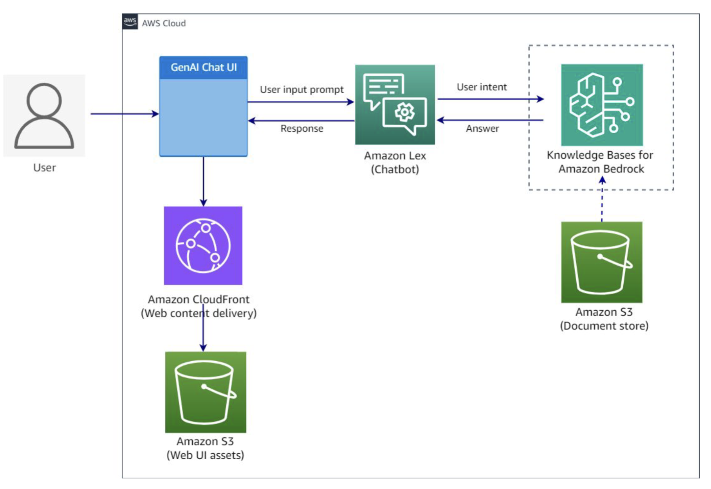

# SDG Amazon GenAI Bedrock Project

Use the Amazon Bedrock FMs to generate responses to user input based on Retrieval Augmented Generation (RAG) data.



## Pre-requisites

- [Python 3.10+](https://www.python.org/downloads/)
- [Pip](https://pip.pypa.io/en/stable/installing/)
- [AWS Account](https://aws.amazon.com/premiumsupport/knowledge-center/create-and-activate-aws-account/)
- [Amazon Bedrock foundation model access](https://docs.aws.amazon.com/bedrock/latest/userguide/getting-started.html)

## Notes

- There might be issues with the `create_knowledge_base.py` and `delete_knowledge_base.py` scripts.
  - The Bedrock API's don't seem 100% stable yet
  - The scripts aren't
- Terraform and CloudFormation Amazon Bedrock resources are not available as of 1/16/24. I've created Python scripts that leverage Boto3 to create and delete the missing AWS resources
  - create_knowledge_base.py
  - delete_knowledge_base.py

## Getting Started

1. Clone or fork this repo and `cd` into the project directory
   ```bash
   git clone https://github.com/SDGProjects/aws-genai-bedrock-project.git
   ```
2. Copy your PDF, Text, CSV, or JSON files to the `rag_data` directory (These files will be uploaded to Amazon S3 with Terraform in the next step)
2. Create Terraform AWS IAM and S3 resources
   ```bash
   cd terraform
   terraform init
   terraform apply
   ```
3. Create Amazon Bedrock and AWS OpenSearch resources
   ```bash
   # Change back to the project root directory
   cd ../
   python create_knowledge_base.py
   # Validate the knowledge base was created successfully
   # either through the script logs and or the AWS Console
   ```
4. Install flaks app dependencies
   ```bash
    cd flask_chatbot
    # Create a virtual environment
    python -m venv venv
    # Activate the virtual environment
    source venv/bin/activate
    python -m pip install -r requirements.txt
    ```
5. Run the app
   ```bash
   python app.py
   ```
6. Open a browser and navigate to `http://localhost:5100`
7. Ask the chatbot a question based on the RAG data you uploaded and validate the response is relevant

## Cleanup

1. Delete the Amazon Bedrock and AWS OpenSearch resources
   ```bash
   python delete_knowledge_base.py
   ```
2. Delete the Terraform AWS IAM and S3 resources
   ```bash
    cd terraform
    terraform destroy
    ```
3. Spin down the Flask app
   ```bash
   # Press CTRL+C to stop the Flask app
   # Deactivate the virtual environment
   deactivate
   ```

## Acknowledgements

Flask App foundation from [skolo-online's chat-gpt-starter repository](https://github.com/skolo-online/chat-gpt-starter)

## TODO:

- [ ] Rewrite Python app to NestJS or another frontend framework
- [x] Add logic to compile files and update Terraform to create the objects in the S3 bucket
- [x] Deploy and validate resources (CloudFront + S3 deployed)
- [ ] Configure the AWS Lex bot Terraform resources
  - [ ] IAM Role/Policy
  - [ ] Lex Bot
  - [ ] Lex Intent
- [ ] Review Terraform AWS Bedrock resources available
  - [ ] https://registry.terraform.io/providers/hashicorp/aws/latest/docs/resources/bedrockagent_agent
- [ ] Update README instructions with project specific create/delete instructions
- [ ] Delete python scripts and files that are not needed/used
